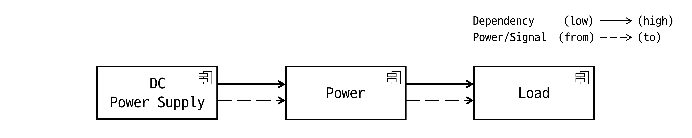
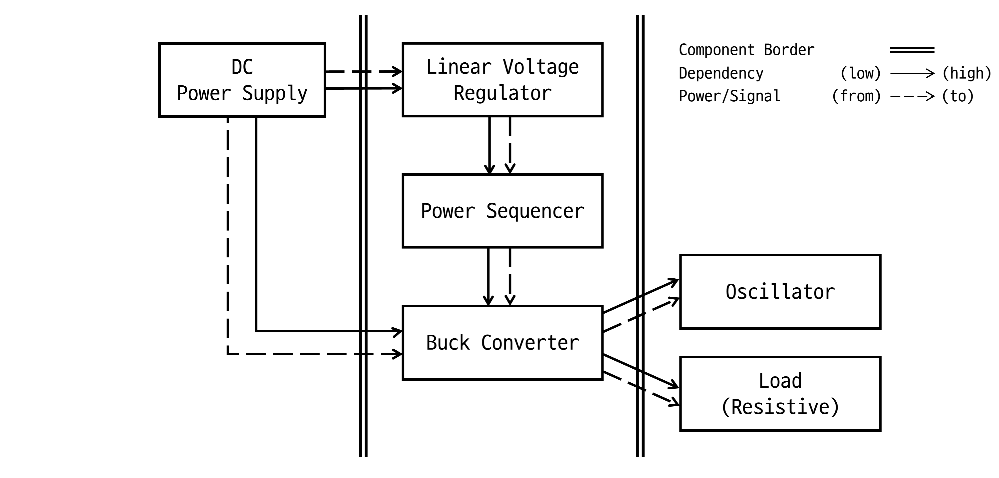
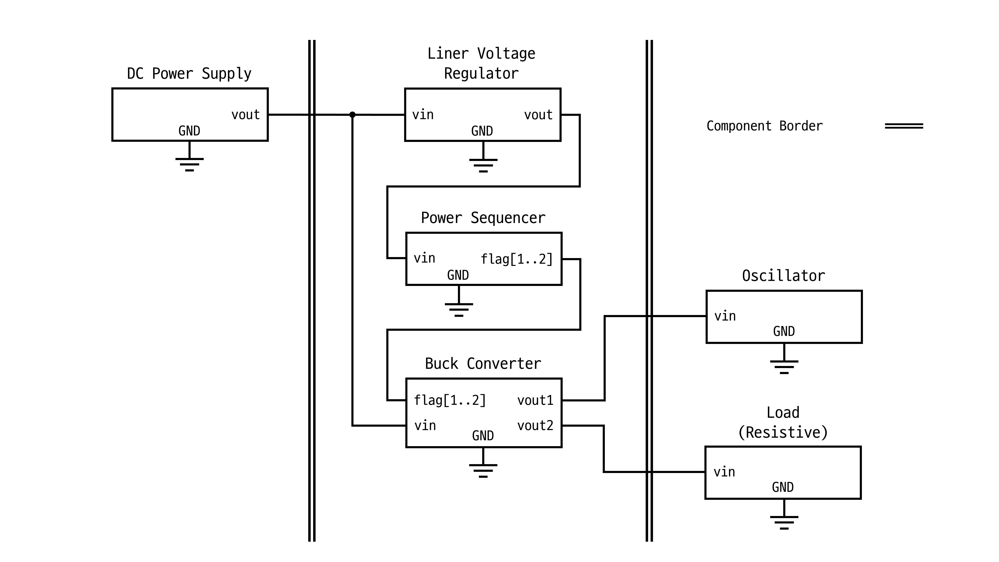
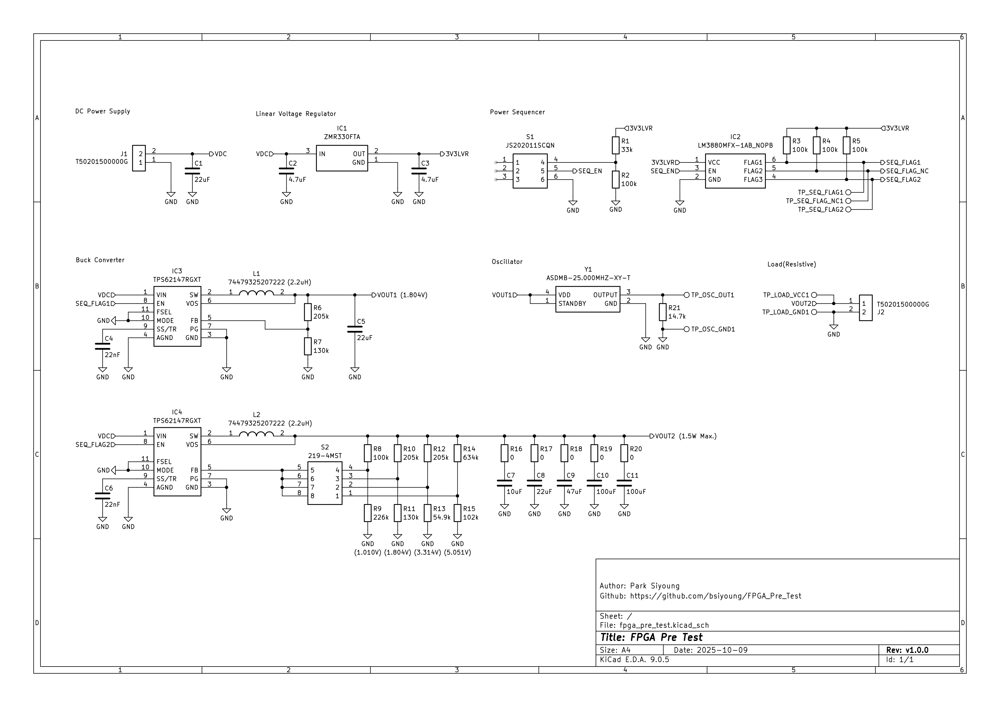
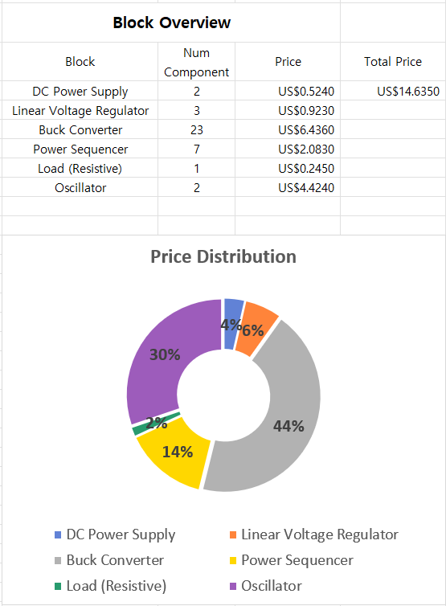
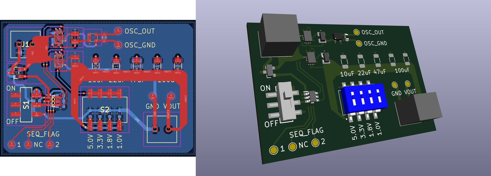

# FPGA_Pre_Test

This simple project is for testing power rails and external oscillator to use them on FPGA circuit design.

## 1. Objectives
1. Check power rails ON/OFF sequencing works properly
2. Check oscillator(25MHz) works properly
3. Get output voltage ripple data by
    + different output capacitance(~200uF) of buck converter
    + different output voltages(1.0~5.0V) of buck converter
    + different load(resistive, ~1.5W consume)

## 2. Architecture Diagram
### 2.1 Module Diagram

### 2.2 Block Diagram

### 2.3 Block Ports

## 3. Circuit Schematic
Footprints of resistors R16~20 will be used as solder jumper. Therefore, there is no actual component needed.

Date of basis for price calculation : 2025.10.21.  
Refer to <a href="./component_list.xlsx">component_list.xlsx</a> for details.

## 4. PCB Design
Manufacturer : JLC PCB  
Gerber File : ./kicad_proj/output
              (./kicad_proj/pcb_output.zip)

