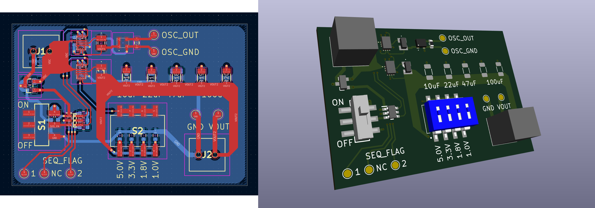

# FPGA_Pre_Test

This simple project is for testing power rails and external oscillator to use them on FPGA circuit design.

## 1. Objectives
1. Check power rails ON/OFF sequencing works properly
2. Check oscillator(25MHz) works properly
3. Get output voltage ripple data by
    + different output capacitance(~200uF) of buck converter
    + different output voltages(1.0~5.0V) of buck converter
    + different load(resistive, ~1.5W consume)

## 2. Directores
|Directory|Description|
|---|---|
|calculation|files for calculation|
|datasheet|datasheets of components|
|diagrams|diagrams images|
|eda_model|EDA model files for KiCAD|
|kicad_proj|KiCAD project directory|
|pcb|PCB images and gerber file|
|readme_img|image for readme file|
|schematic|schematic jpg and pdf file|

## 3. Architecture Diagram
### 3.1 Module Diagram

### 3.2 Block Diagram

### 3.3 Ports Diagram

## 4. Circuit Schematic
Footprints of resistors R16~20 will be used as solder jumper.

 
Date of basis for price calculation : 2025.10.21.  
Refer to <a href="./component_list.xlsx">component_list.xlsx</a> for details.  
* Exclude PCB(USD$20.84/5pcs) and resistive load(USD$8.40).

 
<b>Total: USD$27.203/pcs</b> (incldue PCB and resistive load)

## 5. PCB Design
Manufacturer : JLC PCB  
Gerber File : ./pcb/pcb_gerber.zip (zip file of ./kicad_proj/output)

